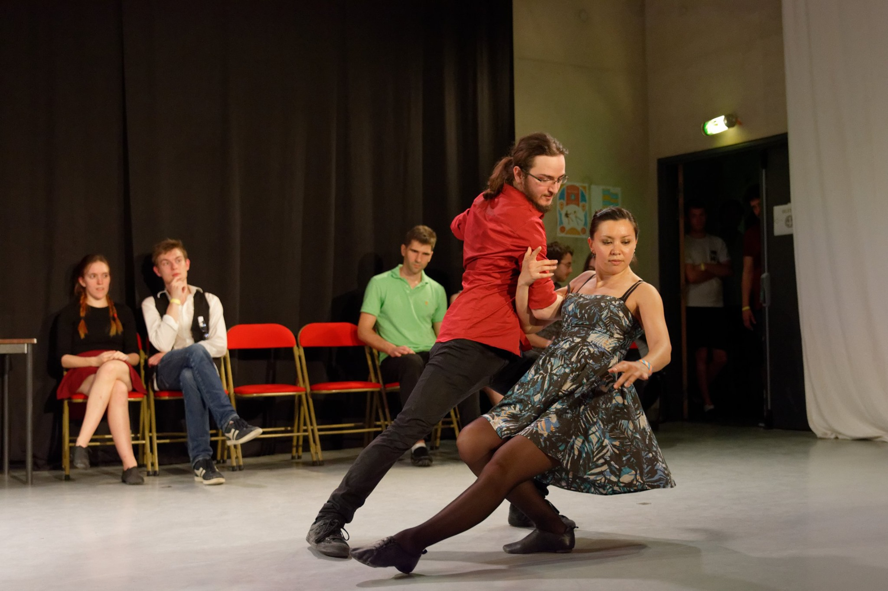

Title: Théo 
Date: 2019-12-06
Category: Profs 

Théo commence la danse côté Swing, durant l’été 2017. De part ses errances sur les quais de Seine et un petit coup de pouce de certaines connaissances, il enchaîne les initiations au Lindy Hop à un rythme effréné durant un mois, s'assurant ainsi d'être vraiment sûr de connaître ses basiques. Après avoir pesé le pour et le contre au moins deux secondes et demi, il rejoint l'école Shake That Swing pour ses premiers cours de danse de couple.

Quelques mois après ses débuts, il se fait traquenarder dans le monde du Rock 4 Temps par les soirées de Télécom. Il se retrouve assez rapidement à suivre les cours au club de l’ENS Ulm et profite d'un déséquilibre leader/follower pour apprendre les deux rôles. Tout comme Claire, Théo se lance dans l'entreprise insensée de la création du Printemps 4 Temps et en profite pour participer à son premier concours. 

Proposition : Actuellement, Théo enseigne dans le cours débutant/intermédiaire avec son amie Claire, et en profite pour jouer avec ses nerfs à grands renforts d’humour plus ou moins douteux. Il va sans dire qu'il continue de pratiquer le Lindy Hop et s'intéresse de près à quelques autres danses, notamment le blues.
